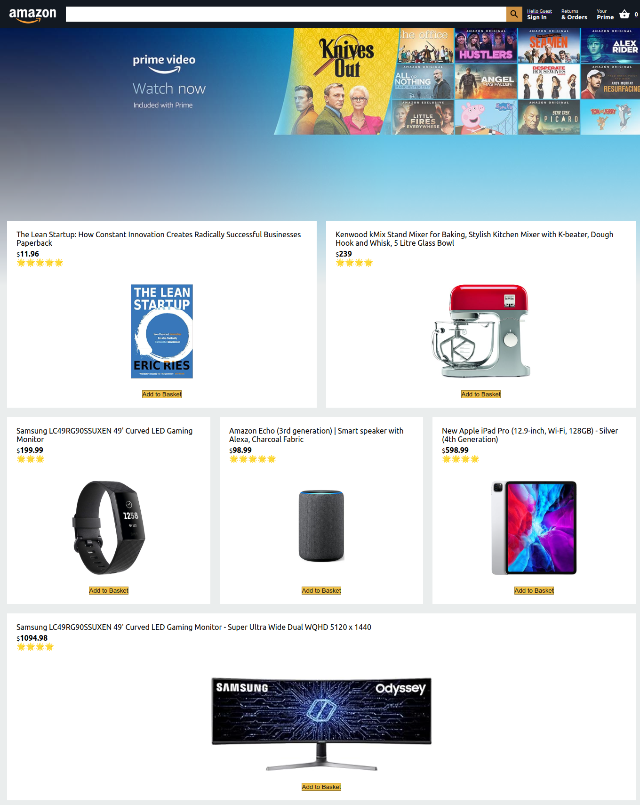
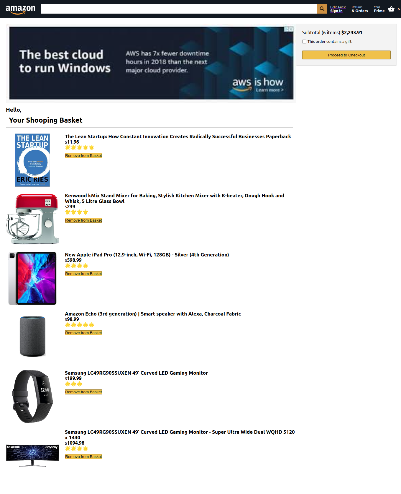

# Amazon Clone

In the project directory, you can run:
```
npm install
npm start
```

Runs the app in the development mode.\
Open [http://localhost:3000](http://localhost:3000) to view it in the browser.

_Different Pages are shown like_ **_Home Page_** _and_ **_Checkout Cart_**

_This is an home page showing the different product and a button to add to busket_
---
## Demo


_Different Pages are shown like_ **_Home Page_** _and_ **_Checkout Cart_**

_This is an Cart Page showing the different product that are added in cart with total amount to be paid_
---
## Demo


 
